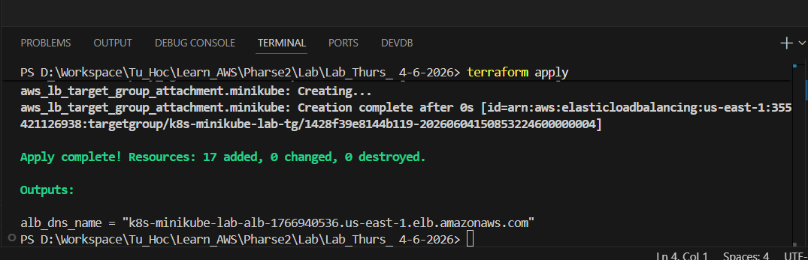
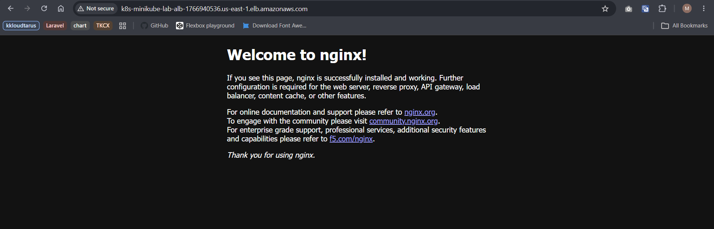

# K8s on AWS - Terraform 1-Click

Bài lab này dùng Terraform để tạo một EC2 Ubuntu 24.04 chạy Minikube bằng Docker
driver, triển khai nginx bằng `kubectl apply` qua SSH và public ứng dụng qua AWS
Application Load Balancer.

Luồng traffic:

```text
Internet -> ALB:80 -> EC2:30080 -> Minikube NodePort:30080 -> nginx Pod:80
```

## Sơ Đồ Kiến Trúc

```text
Local machine
  |
  | terraform apply
  v
+-------------------+
| Terraform         |
| - AWS Provider    |
| - Null Provider   |
+-------------------+
  |
  | AWS Provider tạo hạ tầng
  v
+-----------------------------------------------------------+
| AWS VPC 10.0.0.0/16                                      |
|                                                           |
|  Public Subnet A                  Public Subnet B         |
|  +----------------------+         +--------------------+   |
|  | EC2 Ubuntu 24.04     |         | ALB node           |   |
|  | - Docker             |         |                    |   |
|  | - kubectl            |         +--------------------+   |
|  | - Minikube           |                                  |
|  |                      |         Internet-facing ALB      |
|  |  Minikube Docker     |         Listener :80             |
|  |  +----------------+  |<--------Target Group :30080      |
|  |  | K8s Node       |  |                                  |
|  |  | Service        |  |                                  |
|  |  | NodePort 30080 |  |                                  |
|  |  | nginx Pod :80  |  |                                  |
|  |  +----------------+  |                                  |
|  +----------------------+                                  |
+-----------------------------------------------------------+
  ^
  |
  | Null Provider SSH vào EC2:
  | - chờ /tmp/minikube-ready
  | - upload /tmp/nginx.yaml
  | - chạy kubectl apply
```

Security Group wiring:

- ALB Security Group cho phép inbound TCP `80` từ internet.
- EC2 Security Group cho phép inbound TCP `22` chỉ từ `my_ip_cidr`.
- EC2 Security Group cho phép inbound TCP `node_port` chỉ từ ALB Security Group.
- Kubernetes API không public ra internet.


## Điều Kiện Cần

- Terraform >= 1.6
- AWS credentials đã được cấu hình
- Một cặp SSH key có sẵn trên máy local
- Private key dùng cho Terraform không được bảo vệ bằng passphrase
- Public IP hiện tại của bạn ở định dạng CIDR, thông thường là `/32`

Sao chép `terraform.tfvars.example` thành `terraform.tfvars`, sau đó thay các giá
trị ví dụ bằng thông tin thực tế. Không commit private key hoặc file
`terraform.tfvars` chứa thông tin thật.

## Chạy Terraform

```bash
terraform init
terraform apply
```

Chỉ cần một lần apply từ trạng thái trống. Sau khi apply hoàn tất, Terraform chỉ
output DNS của ALB. ALB health check có thể cần một khoảng thời gian ngắn để đánh
dấu target là healthy.

## Thứ Tự Apply

1. Terraform tạo VPC, hai public subnet, route table và internet gateway.
2. Terraform tạo security group cho ALB và EC2.
3. Terraform tạo EC2 instance Ubuntu 24.04.
4. EC2 `user_data` cài Docker, kubectl và Minikube.
5. Minikube khởi động bằng Docker driver và publish NodePort ra EC2 host.
6. `null_resource.minikube_ready` kết nối SSH và chờ file
   `/tmp/minikube-ready`.
7. `null_resource.deploy_nginx` tải manifest lên EC2 và chạy `kubectl apply`.
8. Terraform chờ nginx Deployment rollout thành công.
9. ALB đăng ký EC2 vào Target Group sau khi NodePort Service tồn tại.

## Thành Phần Được Tạo

AWS Provider tạo:

- VPC `10.0.0.0/16`
- Hai public subnet ở hai Availability Zone
- Internet Gateway và public route table
- Security Group cho ALB và EC2
- AWS Key Pair
- EC2 Ubuntu 24.04 có public IP
- Application Load Balancer, Listener và Target Group

Null Provider tạo:

- Tài nguyên chờ Minikube Ready
- Tài nguyên triển khai nginx bằng `kubectl apply`

Manifest `nginx.yaml.tftpl` tạo:

- Namespace `nginx`
- Deployment dùng image `nginx:alpine`
- Service loại NodePort

## Bảo Mật Mạng

- ALB port `80` cho phép truy cập từ internet.
- EC2 port `22` chỉ cho phép truy cập từ `my_ip_cidr`.
- EC2 NodePort chỉ cho phép truy cập từ Security Group của ALB.
- Kubernetes API không cần public ra internet.

## Trade-Off Của Phương Án Một Lần Apply

Terraform quản lý `null_resource.deploy_nginx`, nhưng không quản lý trực tiếp
từng Kubernetes object như Kubernetes Provider. Nếu manifest thay đổi,
`manifest_sha256` làm cho resource được thay thế và `kubectl apply` chạy lại.

Phương án này ưu tiên yêu cầu một lần `terraform apply` và tránh giới hạn
lifecycle của Kubernetes Provider: provider cần kubeconfig trong giai đoạn plan,
trong khi kubeconfig chỉ tồn tại sau khi EC2 và Minikube đã khởi động.

Dự án sử dụng AWS Provider và Null Provider. Nếu challenge bắt buộc phải sử dụng
Kubernetes Provider hoặc Helm Provider, cần quay lại phương án hai giai đoạn
hoặc dùng một wrapper script chạy hai lần apply.

## Cấu Hình terraform.tfvars

Sao chép file mẫu:

```bash
cp terraform.tfvars.example terraform.tfvars
```

Trên Windows PowerShell có thể dùng:

```powershell
Copy-Item .\terraform.tfvars.example .\terraform.tfvars
```

Lấy public IP hiện tại để điền vào `my_ip_cidr`:

```powershell
(Invoke-RestMethod -Uri "https://checkip.amazonaws.com").Trim()
```

Ví dụ:

```hcl
my_ip_cidr = "203.0.113.10/32"
```

`my_ip_cidr` nên là public IP hiện tại của máy local kèm `/32`. Nếu IP mạng thay đổi,
cập nhật biến này rồi chạy lại `terraform apply` để Terraform sửa Security Group SSH.

## Truy Cập Ứng Dụng

Lấy DNS của ALB:

```bash
terraform output alb_dns_name
```

Mở ứng dụng trên browser:

```text
http://<alb_dns_name>
```

Request sẽ đi theo luồng:

```text
Browser -> ALB:80 -> EC2:30080 -> Minikube NodePort -> nginx Pod:80
```

## Bằng Chứng Chạy Thành Công
- Apply one click

- Truy cập tới url ALB đã tạo


## Destroy

```bash
terraform destroy
```

Destroy provisioner sẽ chạy `kubectl delete` trước khi EC2 bị xóa. Nếu EC2 không
còn truy cập được, bước xóa manifest có thể thất bại; các Kubernetes object vẫn
sẽ biến mất khi EC2 bị xóa.

## Lỗi SSH Private Key Có Passphrase

Terraform `remote-exec` không thể nhập passphrase tương tác. Nếu gặp lỗi
`this private key is passphrase protected`, hãy dùng một private key riêng không
có passphrase cho lab. Không commit private key vào Git.
