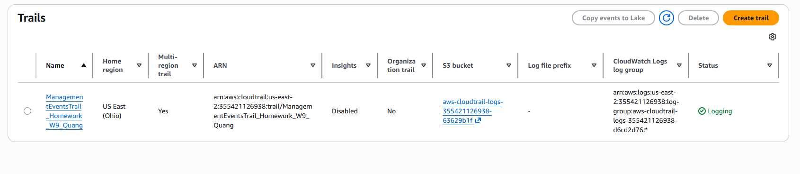
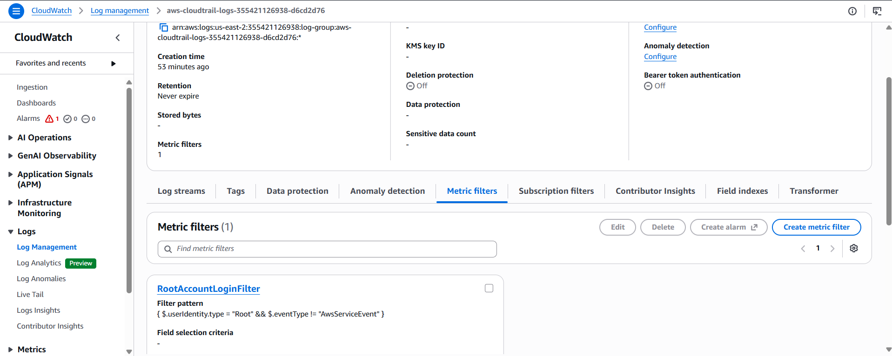
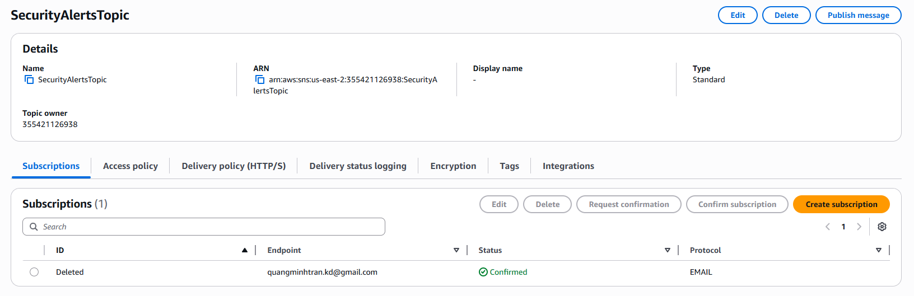
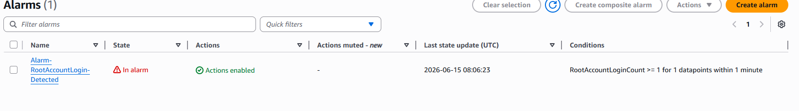

# Evidence - Alert on AWS Root Account Login

## Thông tin tổng quan

- **Lab:** Alert on AWS Root Account Login
- **Mục tiêu:** Cấu hình CloudTrail, CloudWatch Metric Filter, CloudWatch Alarm và SNS Email Notification để phát hiện sự kiện đăng nhập bằng AWS Root Account.
- **Region thực hiện:** US East (Ohio) - `us-east-2`
- **SNS Topic:** `SecurityAlertsTopic`
- **CloudWatch Alarm:** `Alarm-RootAccountLogin-Detected`
- **Metric Filter:** `RootAccountLoginFilter`

## Evidence 1 - CloudTrail đã bật logging thành công

Ảnh chụp tại **CloudTrail > Trails** cho thấy trail đã được tạo và đang ghi log.

Bằng chứng cần đối chiếu:

- Trail `ManagementEventsTrail_Homework_W9_Quang` hiển thị **Status = Logging**.
- Cột **CloudWatch Logs log group** đã liên kết với log group của CloudWatch.
- Trail được cấu hình multi-region.



## Evidence 2 - Metric Filter lọc sự kiện Root Account

Ảnh chụp tại **CloudWatch > Log groups > aws-cloudtrail-logs-355421126938-d6cd2d76 > Metric filters** cho thấy metric filter đã được tạo trên log group của CloudTrail.

Bằng chứng cần đối chiếu:

- Metric filter name: `RootAccountLoginFilter`
- Filter pattern:

```text
{ $.userIdentity.type = "Root" && $.eventType != "AwsServiceEvent" }
```



## Evidence 3 - SNS Email Subscription đã được confirm

Ảnh chụp tại **Amazon SNS > Topics > SecurityAlertsTopic > Subscriptions** cho thấy email subscription đã sẵn sàng nhận cảnh báo.

Bằng chứng cần đối chiếu:

- Topic name: `SecurityAlertsTopic`
- Protocol: `EMAIL`
- Subscription status: **Confirmed**



## Evidence 4 - Test case thực tế: Alarm đã được kích hoạt

Ảnh chụp tại **CloudWatch > Alarms > All alarms** cho thấy alarm đã chuyển sang trạng thái cảnh báo sau khi phát sinh sự kiện đăng nhập bằng Root Account.

Bằng chứng cần đối chiếu:

- Alarm name: `Alarm-RootAccountLogin-Detected`
- State: **In alarm**
- Actions: **Actions enabled**
- Condition: `RootAccountLoginCount >= 1 for 1 datapoints within 1 minute`
- Last state update: `2026-06-15 08:06:23 UTC`



## Kết luận

Hệ thống cảnh báo đăng nhập AWS Root Account đã được cấu hình và kiểm thử thành công với các thành phần chính:

- CloudTrail đã ghi nhận management events và đẩy log sang CloudWatch Logs.
- CloudWatch Metric Filter đã lọc đúng sự kiện Root Account login.
- SNS Email Subscription đã được confirm.
- CloudWatch Alarm đã kích hoạt thành công khi có sự kiện Root Account login.
