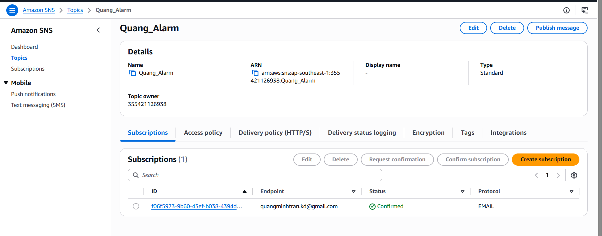
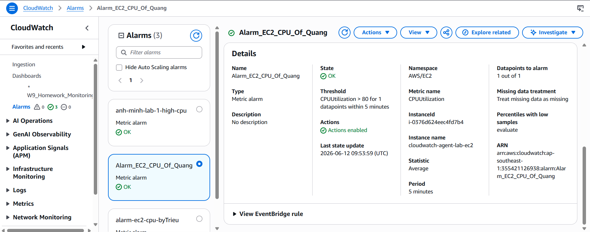
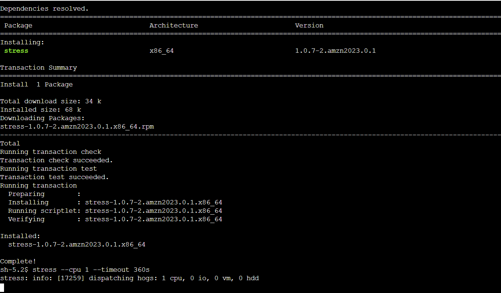
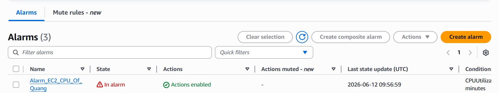
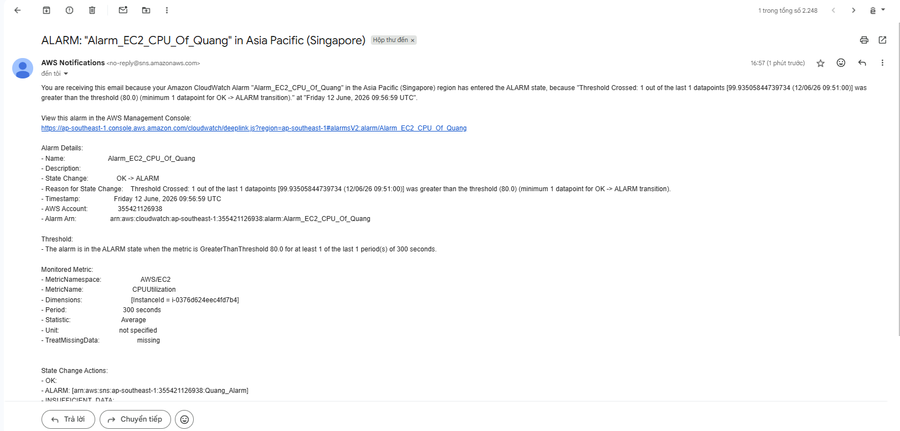

# Evidence: CPU Alarm and Email Notification via SNS

## Lab Objective

Thiết lập CloudWatch Alarm để giám sát metric `CPUUtilization` của EC2. Khi CPU trung bình lớn hơn `80%` trong một chu kỳ `5 phút`, CloudWatch chuyển alarm sang trạng thái `In alarm` và gửi email cảnh báo thông qua Amazon SNS.

EC2 được giám sát:

- Instance name: `cloudwatch-agent-lab-ec2`
- Instance ID: `i-0376d624eec4fd7b4`
- AWS Region: Singapore (`ap-southeast-1`)

## 1. SNS Topic and Confirmed Email Subscription

SNS topic loại `Standard` có tên `Quang_Alarm` đã được tạo. Email subscription sử dụng protocol `EMAIL` và có trạng thái `Confirmed`.



Trạng thái `Confirmed` chứng minh người nhận đã xác nhận subscription và SNS có thể gửi thông báo alarm đến email đã đăng ký.

## 2. CloudWatch CPU Alarm Configuration

CloudWatch Alarm có tên `Alarm_EC2_CPU_Of_Quang` được cấu hình với các thông số:

- Namespace: `AWS/EC2`
- Metric: `CPUUtilization`
- Statistic: `Average`
- Period: `5 minutes`
- Threshold: `CPUUtilization > 80`
- Datapoints to alarm: `1 out of 1`
- Actions: `Enabled`

Trước khi thực hiện stress test, alarm đang ở trạng thái `OK`.



Ảnh xác nhận alarm đang theo dõi đúng EC2 instance và đúng điều kiện CPU lớn hơn 80% trong 5 phút.

## 3. Generate High CPU Load

Công cụ `stress` được cài đặt trên EC2 Amazon Linux 2023. Lệnh sau tạo tải trên một CPU trong 360 giây, đủ thời gian để CloudWatch đánh giá chu kỳ 5 phút:

```bash
stress --cpu 1 --timeout 360s
```



Dòng `dispatching hogs: 1 cpu` xác nhận tiến trình stress đã bắt đầu tạo tải CPU.

## 4. Alarm Changed to In Alarm

Sau khi CPU vượt ngưỡng, alarm `Alarm_EC2_CPU_Of_Quang` chuyển sang trạng thái `In alarm`. Notification action vẫn ở trạng thái `Actions enabled`.



Điều này chứng minh CloudWatch đã phát hiện CPU vượt quá ngưỡng được cấu hình.

## 5. Email Alert Received from Amazon SNS

Email cảnh báo từ `AWS Notifications` đã được gửi thành công với tiêu đề:

```text
ALARM: "Alarm_EC2_CPU_Of_Quang" in Asia Pacific (Singapore)
```



Nội dung email xác nhận:

- State change: `OK -> ALARM`
- Threshold: lớn hơn `80.0`
- Giá trị CPU ghi nhận: khoảng `99.94%`
- Period: `300 seconds`
- Statistic: `Average`
- Metric: `CPUUtilization`
- Instance ID: `i-0376d624eec4fd7b4`
- SNS action: topic `Quang_Alarm`

## Conclusion

Lab đã hoạt động thành công theo luồng:

```text
EC2 CPU stress
    -> CPUUtilization > 80% trong 5 phút
    -> CloudWatch Alarm chuyển sang ALARM
    -> Amazon SNS kích hoạt notification
    -> Email cảnh báo được gửi đến subscriber
```

Các ảnh minh chứng xác nhận SNS subscription đã được xác nhận, alarm được cấu hình đúng điều kiện, stress test tạo tải CPU thành công, CloudWatch chuyển trạng thái alarm và người nhận đã nhận được email cảnh báo từ AWS.
