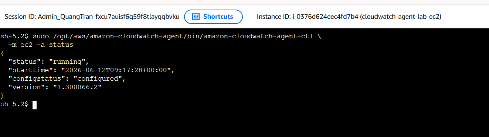
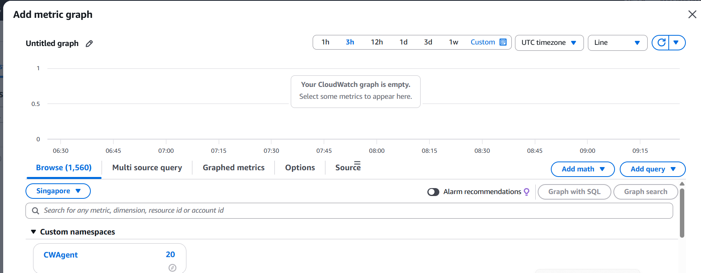

# Evidence: CloudWatch Agent Installed Successfully

## 1. CloudWatch Agent Status

CloudWatch Agent được kiểm tra trực tiếp trên EC2 instance bằng lệnh:

```bash
sudo /opt/aws/amazon-cloudwatch-agent/bin/amazon-cloudwatch-agent-ctl \
  -m ec2 -a status
```



Kết quả trong ảnh xác nhận:

- EC2 instance ID: `i-0376d624eec4fd7b4`.
- Agent có trạng thái `running`.
- Cấu hình có trạng thái `configured`.
- Phiên bản CloudWatch Agent: `1.300066.2`.

Điều này chứng minh CloudWatch Agent đã được cài đặt, cấu hình và khởi động thành công trên EC2.

## 2. Metrics Received by CloudWatch

Sau khi Agent khởi động, kiểm tra tại **CloudWatch > Metrics > All metrics** trong Region Singapore (`ap-southeast-1`).



Ảnh chụp cho thấy:

- Custom namespace `CWAgent` đã xuất hiện trong CloudWatch.
- Namespace đang chứa `20` metrics do CloudWatch Agent gửi từ EC2.

Điều này chứng minh Agent không chỉ đang chạy trên EC2 mà còn kết nối thành công với Amazon CloudWatch và gửi dữ liệu metrics về dịch vụ.

## Conclusion

CloudWatch Agent đã được triển khai thành công bằng Terraform. Hai bằng chứng xác nhận đầy đủ trạng thái hoạt động của Agent trên EC2 và việc CloudWatch đã tiếp nhận các custom metrics trong namespace `CWAgent`.
